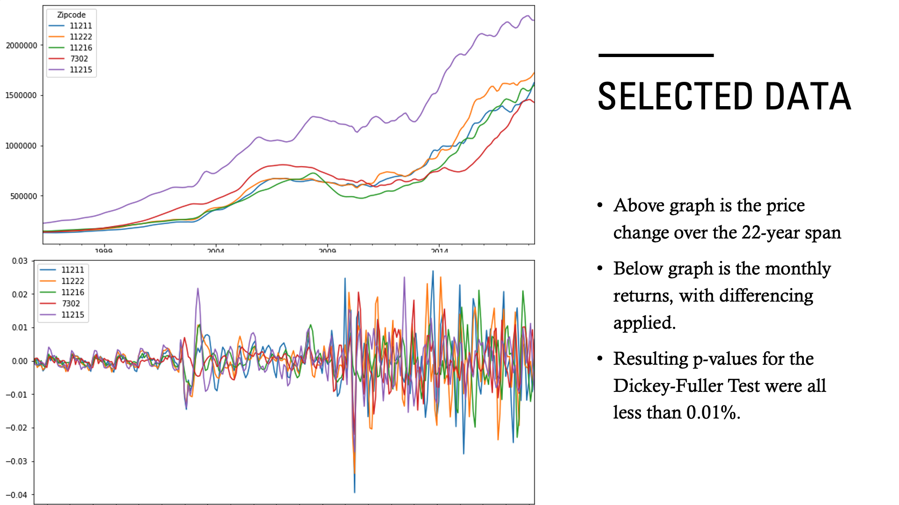
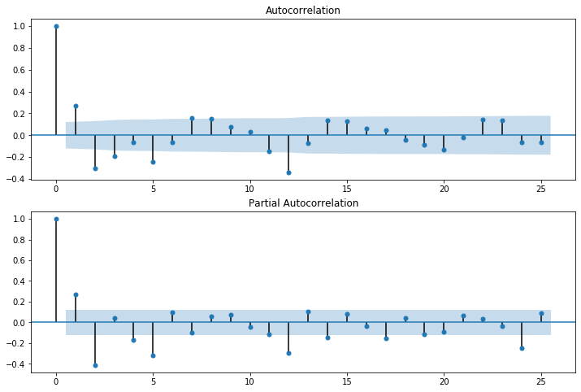
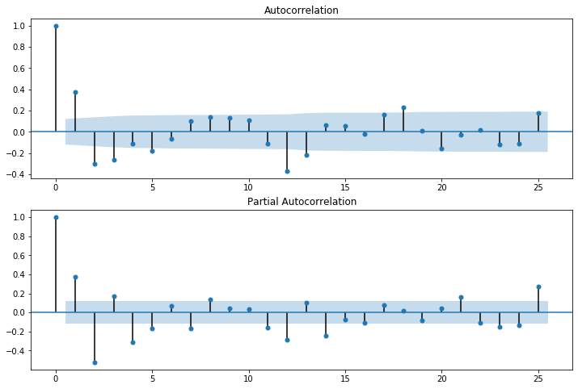
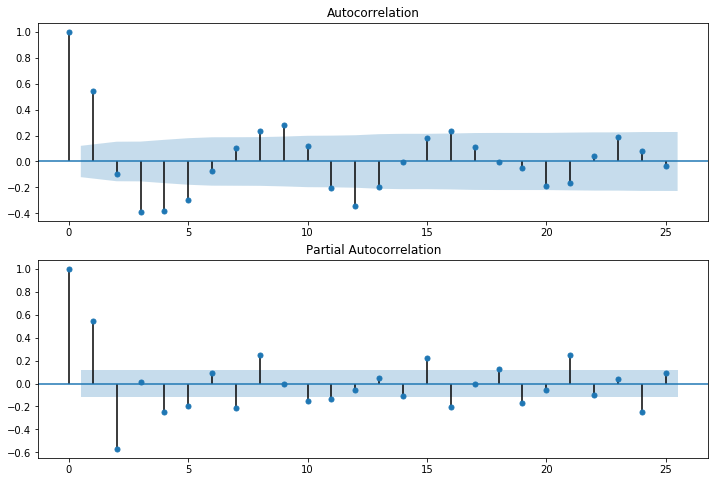
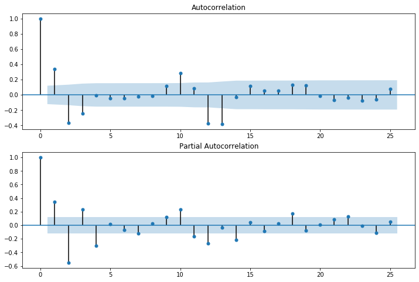
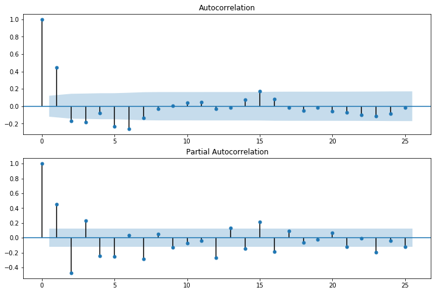
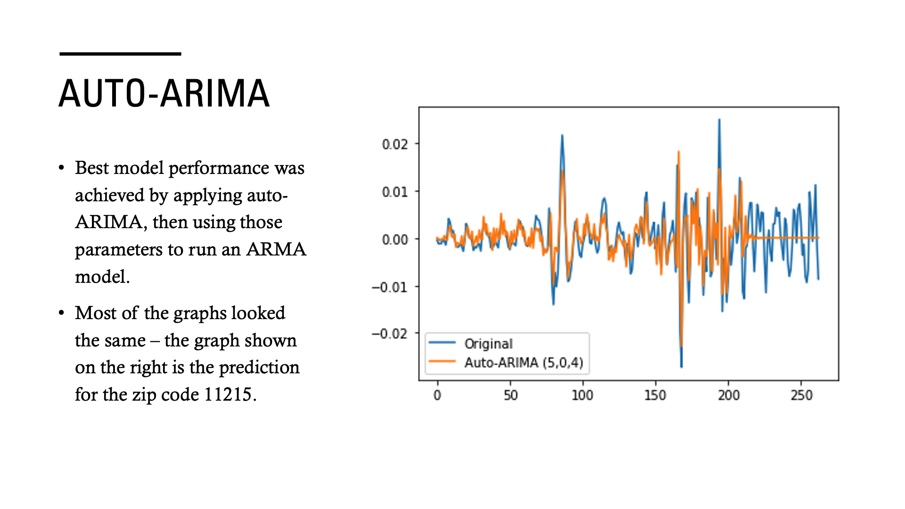
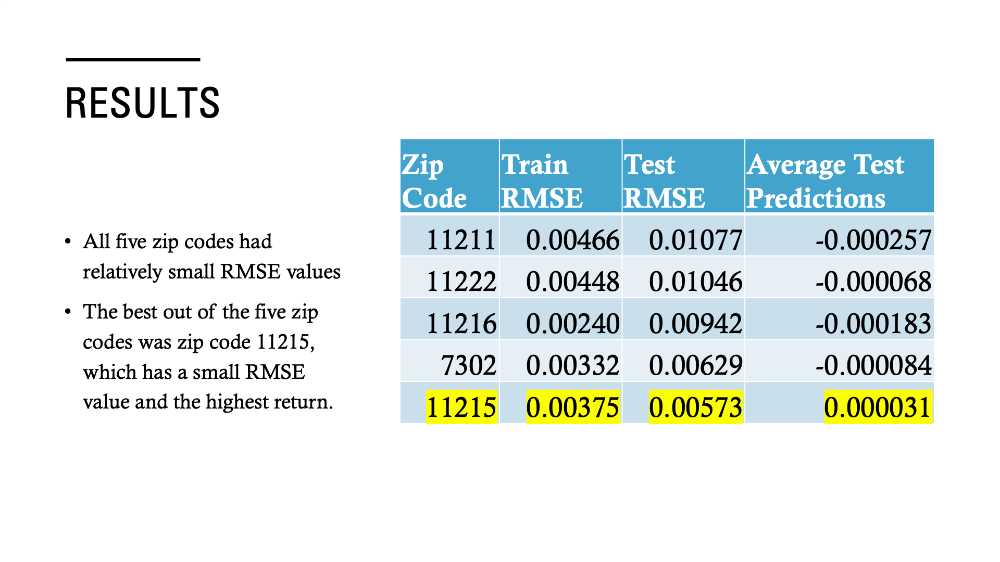

# Zillow Real Estate Investment Recommender

## PURPOSE: 
This notebook aims to suggest potential locations for investing in U.S. real estate, based on historical data on the average housing prices. 

## BUSINESS PROBLEM: 
To suggest the best zip codes to invest in the U.S. as a retirement plan, based on Zillow Open Data.

The clients utilizing this notebook are people who intend to buy houses purely for investment purposes and not for residence. For this reason, in-depth considerations for each region and neighborhood are not included - only monthly price movements will be considered.

## DATA: 
Data used in this notebook contains the average monthly house prices from April 1996 to April 2018 (22 year span), organized by zipcode.
The dataframe contains 14722 rows and 272 columns.
This data can be accessed on the Zillow website (https://www.zillow.com/research/data/).

## DATA SELECTION:
Selection of the top 5 zipcodes to invest was carried out by weighing four factors:
- Size Rank (20%)
- Price Range (20%)
- Coefficient of Variance (60%)
- Return on Investment

The top five zipcodes that were selected were: 11211,	11222,	11216,	07302, and	11215.
All five zipcodes were areas within the New York City Metropolitan Area.

## ACF AND PACF:
zip 11211:

zip 11222:

zip 11216:

zip 07302:

zip 11215:

## RESULTS:
Best zipcode to invest is the fifth zipcode - it has the lowest test RMSE and the third lowest train RMSE. It also has the highest average predicted growth out of the five top zipcodes.

11215 is the zipcode for Park Slope, located in Brooklyn, NY.

Train RMSE: 0.00375
Test RMSE: 0.00573
Average Test Predictions: 0.000031

## FUTURE WORKS / RECOMMENDATIONS:
- Incorporating stronger nonlinear models, such as Facebook Prophet will increase the model’s predictive power.
- Including exogenous variables such as tax rates, median income of the population, monthly housing cost, cost of living, crime grade, and more.
- The fact that the top five zip codes all came from the New York City Metropolitan Area may suggest that other areas that has not seen high growth yet may yield high returns in the coming years
